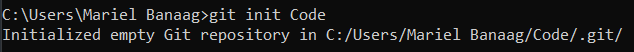
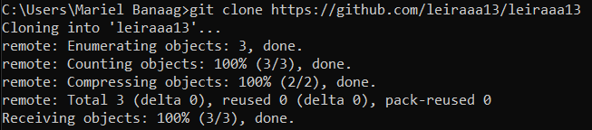
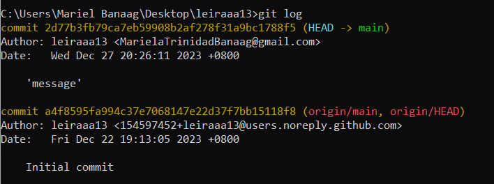
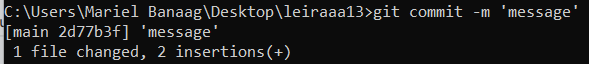

 

# Hola! I'm Mariel Banaag🥰 
Feel free to call me Mariel or Riel

### 💡Personal Snapshot
- 🤎 Age: 20 years old
- 📖 Education: Currently in my second year pursuing a degree in BSIT.
- 💻 Background: Familiar with coding and always excited to delve deeper into the world of technology.
- 🌐 Smart Things Enthusiast: Fascinated by the world of smart devices.
- 🗂️ Data Organization: I find joy in organizing and making sense of data, turning chaos into order.
- 📧 How to reach me: MarielaTrinidadBanaag@gmail.com
- 😄 Fun fact: I enjoy the company of my furry friends.

## Git Commands Cheat Sheet:
- **git init**      
  ✨ Create an empty Git repository or reinitialize an existing one    
  🧩 Parameter: none    
  👉 Example:   
      

- **git clone**  
  ✨ Clone a repository into a new directory   
  🧩 Parameter: [url]    
  👉 Example:   
      

- **git log**   
  ✨ Show the commit logs    
  🧩 Parameter: none    
  👉 Example:   
      

- **git status**  
  ✨ Show the working tree status    
  🧩 Parameter: none    
  👉 Example:  
      

- **git commit**
  ✨ Record changes to the repository    
  🧩 Parameter: -m "[descriptive message]"    
  👉 Example:   
        

##  Thanks for visiting my profile👋

